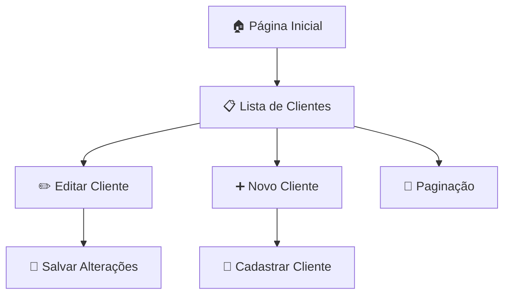

# 💈 Barber Shop UI

Interface web para gestão de clientes de uma barbearia, construída com Angular. Inclui funcionalidades como cadastro, listagem, edição de clientes e paginação personalizada.

---

## 🚀 Como executar

### 🟢 Modo tradicional (Angular CLI)

1. Instale as dependências:
```bash
npm install
```

2. Inicie o servidor local:
```bash
ng serve
```

3. Acesse no navegador:
```
http://localhost:4200
```

---

### 🐳 Modo Docker (opcional)

1. Execute:
```bash
docker-compose up --build
```

2. Acesse:
```
http://localhost:4200
```

---

## 🧱 Estrutura do Projeto

```
src/app/
├── clients/
│   ├── components/
│   │   ├── client-form/         # Formulário de cliente (criar/editar)
│   │   └── client-table/        # Tabela com paginação personalizada
│   ├── list-clients/            # Página de listagem
│   ├── new-client/              # Página de novo cliente
│   ├── edit-client/             # Página de edição de cliente
│   └── client.models.ts         # Interfaces e tipos
│
├── app.routes.ts                # Definição de rotas
├── app.config.ts                # Configurações da aplicação
├── app.component.*              # Componente raiz
└── ...
```

---

## 🔁 Diagrama Mermaid - Fluxo do Sistema



---

## 👨‍💻 Autor

Desenvolvido por [Seu Nome].  
Este projeto é open-source para fins de estudo, portfólio e experimentação com Angular e Docker.
