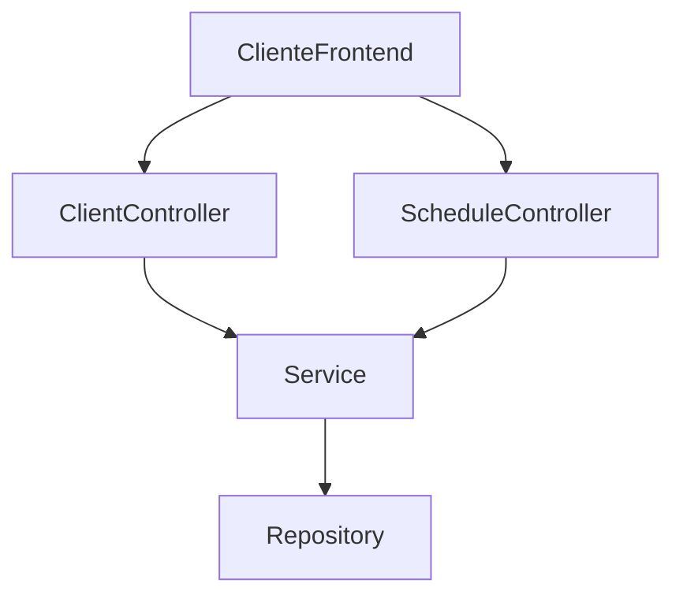

# 💈 Barber Shop API

Este é o backend da aplicação **Barber Shop**, construído com Kotlin + Spring Boot. Fornece uma REST API para cadastro de clientes e agendamento de horários.

---

## 🚀 Como executar

### ▶️ Usando Docker

1. Execute:
```bash
docker-compose up --build
```

2. Acesse:
```
http://localhost:8080
```

---

### ⚙️ Execução manual (sem Docker)

1. Configure um banco PostgreSQL com:
   - Database: `barber-shop-api`
   - User: `barber-shop-api`
   - Password: `barber-shop-api`

2. Execute a aplicação com perfil `dev`:
```bash
./gradlew bootRun --args='--spring.profiles.active=dev'
```

---

## 📦 Estrutura do Projeto

```
src/main/java/br/com/dio/barbershopui/
├── controller/              # Endpoints REST (Cliente, Agendamento)
│
├── controller/request/      # DTOs para entrada de dados
├── controller/response/     # DTOs para saída de dados
│
├── config/                  # Configurações (ex: CORS)
├── service/                 # Regras de negócio (em desenvolvimento)
├── repository/              # Interfaces com o banco de dados
└── BarberShopUiApplication.kt  # Classe principal da aplicação
```

---

## 🔁 Diagrama Mermaid - Fluxo da API



---

## 📌 Endpoints REST (principais)

### 👤 Cliente
- `POST /clients` — Criar cliente
- `GET /clients` — Listar clientes
- `GET /clients/{id}` — Buscar cliente por ID
- `PUT /clients/{id}` — Atualizar cliente
- `DELETE /clients/{id}` — Remover cliente

### 📅 Agendamento
- `POST /schedules` — Agendar horário
- `GET /schedules/client/{id}` — Buscar agendamentos por cliente

---

## 🐘 Banco de dados

- PostgreSQL
- Configurado via Docker
- Porta padrão: `5432`

---

## 👨‍💻 Autor

Desenvolvido por Álvaro Silva.  

